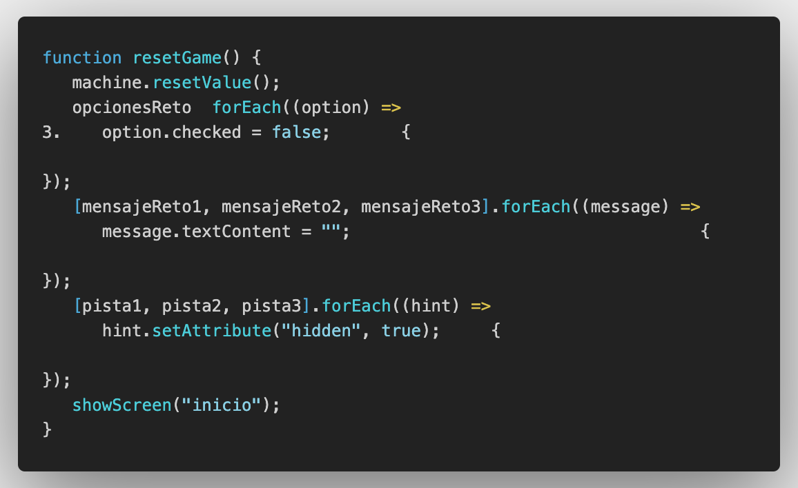
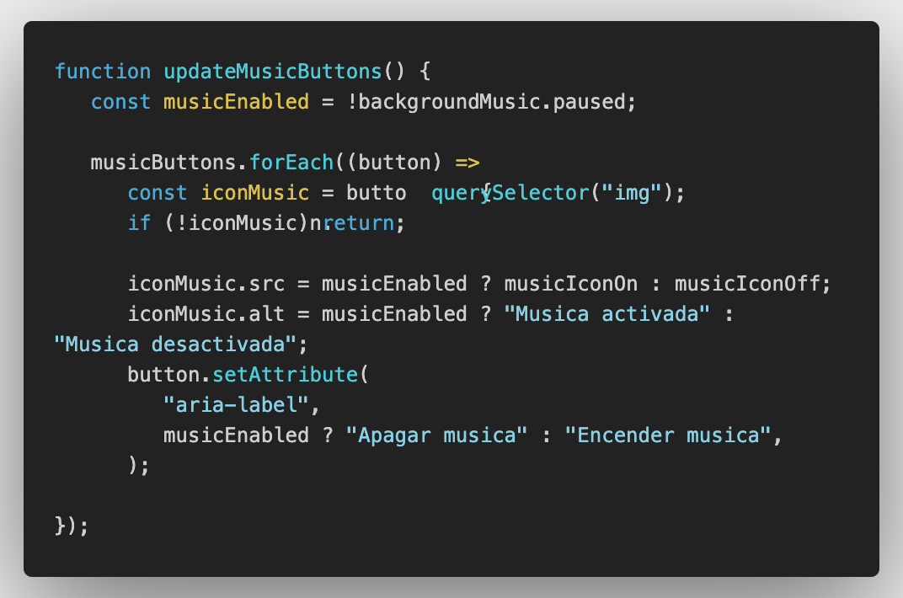
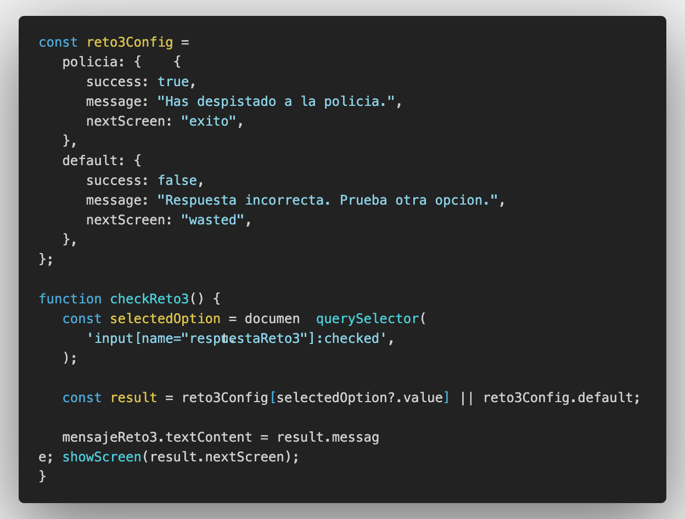

# Escape Room Web

## Descripcion del proyecto

Escape Room Web es una aplicacion web inspirada en el universo GTA. El jugador debe superar una serie de retos para escapar de Los Santos antes de ser atrapado. El proyecto esta pensado como un MVP funcional para practicar desarrollo front-end con HTML, CSS y JavaScript.

## Objetivo del MVP

El objetivo es construir un Escape Room en navegador que incluya:

- Al menos 3 pruebas o retos
- Navegacion entre pantallas o estados
- Logica de juego con JavaScript
- Validaciones de respuestas correctas e incorrectas
- Manipulacion del DOM para mostrar el progreso del jugador

## Contenido del juego

La aplicacion incluye los siguientes estados principales:

- Pantalla de inicio
- Reto 1: codigo secreto para arrancar el coche
- Reto 2: secuencia numerica para abrir la caja fuerte
- Reto 3: adivinanza final para escapar de la policia
- Pantalla final de exito
- Pantalla final de derrota

## Analisis y planificacion

Antes de desarrollar el proyecto se definio un MVP sencillo, claro y explicable en una demo. La prioridad fue construir una experiencia corta pero funcional, centrada en tres retos principales y en una navegacion facil de seguir.

Aspectos definidos en esta fase:

- Tema del juego: escape ambientado en GTA
- Flujo principal: inicio -> retos -> final
- Tipo de pruebas: input, botones y seleccion de respuesta
- Requisitos tecnicos: HTML, CSS, JavaScript y DOM
- Reparto del trabajo por roles dentro del equipo

## Diseno

El diseno busca transmitir una experiencia arcade con una atmosfera de tension y huida. Se trabajo una identidad visual basada en:

- Ambientacion inspirada en GTA
- Pantallas diferenciadas por estados del juego
- Textos narrativos para introducir cada reto
- Uso de botones, pistas y mensajes visuales de feedback
- Musica para reforzar la inmersion

## Desarrollo

Durante el desarrollo se implementaron las siguientes funcionalidades:

- Pantalla inicial con introduccion narrativa
- Navegacion entre secciones usando JavaScript
- Validacion de respuestas en cada reto
- Sistema de victoria y derrota
- Reinicio del juego
- Mostrar y ocultar pistas
- Control de musica dentro de la interfaz

### Ejemplos de logica implementada

- Comprobacion del codigo correcto en el reto 1
- Validacion de la opcion seleccionada en el reto 2
- Lectura de radio buttons en el reto 3
- Cambio dinamico de pantalla con manipulacion del DOM
- Reset del estado del juego al reiniciar

### Ejemplos de funcionalidades desarrolladas

#### Reset



#### Encender/Apagar la musica



#### Logica Reto 3



## Pruebas

Para validar el MVP se comprobaron los siguientes casos:

- El boton de empezar muestra correctamente el primer reto
- Una respuesta correcta permite avanzar al siguiente reto
- Una respuesta incorrecta lleva a la pantalla de derrota
- El juego puede reiniciarse desde las pantallas finales
- Las pistas se muestran y ocultan correctamente
- La musica puede activarse y desactivarse

### Casos que se pueden enseñar en la demo

- Caso correcto: resolver los tres retos y llegar a la pantalla final de exito
- Caso de error: introducir una respuesta incorrecta o elegir una opcion equivocada y mostrar la pantalla de derrota

## Roles del equipo

- UX/UI y Game Design: **Roman Dzhamalov**
- HTML, CSS y Game Design, Product Owner: **Ekaterina Zotova**
- JavaScript y Game Design, Scrum Master: **Alexander Yakovlev**

### Ejemplo de historia de usuario

**Tarea 1: Empezar el juego**

Como jugador, quiero pulsar un boton para empezar el juego y entrar en el escape room.

**Criterios de aceptacion**

- Existe un boton "Empezar"
- Al hacer click desaparece la pantalla inicial
- Se muestra la primera prueba

**Responsable**

- Pendiente de completar por el equipo

**Estado**

- Done

## Tecnologias utilizadas

- Figma
- Miro
- HTML5
- CSS3
- JavaScript
- Git
- Github

## Estructura del proyecto

```text
/project
|-- index.html
|-- style.css
|-- script.js
|-- /assets
|   |-- SlotMachine.css
|   |-- SlotMachine.js
```

## Equipo

- UX/UI y Game Design: **Roman Dzhamalov**
- HTML, CSS y Game Design: **Ekaterina Zotova**
- JavaScript y Game Design: **Alexander Yakovlev**

## Demo

GitHub Pages: https://alexjyad.github.io/Tu-Escape-Room-Web/

## Como ejecutar el proyecto

1. Clona o descarga este repositorio.
2. Abre `index.html` en tu navegador.

## Estado del proyecto

MVP funcional en desarrollo y preparado para presentacion.

## Screenshots

### Inicio


### Reto 1


### Reto 2


### Reto 3


### Pantalla final


